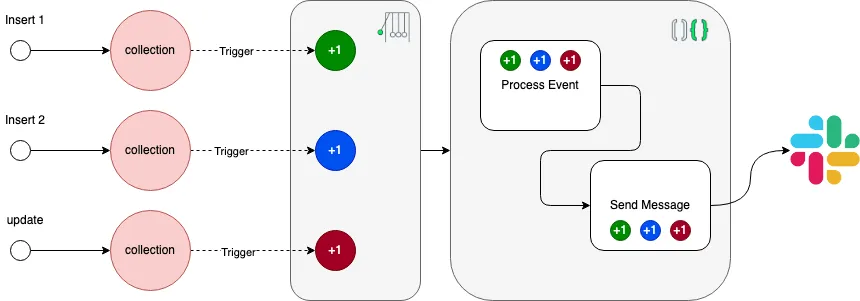
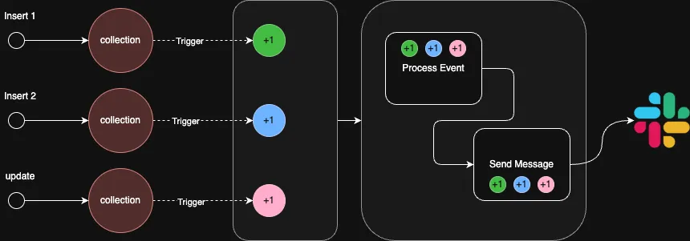
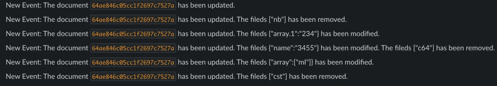

In this tutorial, we will explore a seamless integration of your database with Slack using Atlas Triggers and the Slack API. Discover how to effortlessly send notifications to your desired Slack channels, effectively connecting the operations happening within your collections and relaying them in real-time updates.

The overall flow will be:

{: .light }
{: .dark }
_High-level overview flow diagram of the proposed solution_

In this way, every time an operation that we need to trace is registered, the content of the transaction itself will be processed and used to send a message to a specific Slack channel.

## Creating the application in Atlas

To begin with, we will create a new application in Atlas. A step-by-step guide illustrating this process is available in our [documentation](https://www.mongodb.com/docs/atlas/app-services/apps/create/#create-an-app-services-app).

Once this has been completed, we are ready to start creating our first [database trigger](https://www.mongodb.com/docs/atlas/app-services/triggers/database-triggers/#database-triggers) that will react every time there is an operation in a certain collection.

## Atlas trigger

For this tutorial, we will create a trigger that monitors all changes in a test collection for `insert`, `update`, and `delete` operations.

To [create a new database trigger](https://www.mongodb.com/docs/atlas/atlas-ui/triggers/), you will need to:

1. Click the **Data Services** tab in the top navigation of your screen if you haven’t already navigated to Atlas.
2. Click **Triggers** in the left-hand navigation.
3. On the **Overview** tab of the **Triggers** page, click **Add Trigger** to open the trigger configuration page.
4. Enter the [configuration values](https://www.mongodb.com/docs/atlas/triggers/trigger-configuration/#std-label-database-trigger-configuration) for the trigger and click **Save** at the bottom of the page.

Please note that this trigger will make use of the [**_event ordering_**](https://www.mongodb.com/docs/atlas/app-services/triggers/database-triggers/#configuration) as we want the operations to be processed according to when they were performed.

Finally, this trigger will be linked to a `processEvent` function which we'll see below.

## Atlas functions

To [create an Atlas function](https://www.mongodb.com/docs/atlas/app-services/functions/) using the UI, we need to:

1. Click the **Data Services** tab in the top navigation of your screen if you haven’t already navigated to Atlas.
2. Click **Functions** in the left navigation menu.
3. Click **New Function** in the top right of the **Functions** page.
4. Enter a unique, identifying name for the function in the **Name** field.
5. Configure **User Authentication**. Functions in App Services always execute in the context of a specific application user or as a system user that bypasses rules. For this tutorial, we are going to use **System user**.

### "processEvent" function

The `processEvent` function will process the change events every time an operation we are monitoring in the given collection is processed. In this way, we are going to create an object that we will then send to the function in charge of sending this message in Slack.

The code of the function is the following:

```js
exports = function(changeEvent) {
  
  const docId = changeEvent.documentKey._id;

  const { updateDescription, operationType } = changeEvent;
  
  var object = {
    operationType,
    docId,
  };

  if (updateDescription) {
    const updatedFields = updateDescription.updatedFields; // A document containing updated fields
    const removedFields = updateDescription.removedFields; // An array of removed fields
    object = {
      ...object,
      updatedFields,
      removedFields
    };
  }
  
  const result = context.functions.execute("sendToSlack", object);
  
  return true;
};
````

In this function, we will create an object that we will then send as a parameter to another function that will be in charge of sending to our Slack channel.

Here we will use [change event](https://www.mongodb.com/docs/atlas/app-services/triggers/database-triggers/#database-change-events) and its properties to capture the:

1. `_id` of the object that has been modified/inserted.
2. The operation that has been performed.
3. Fields of the object that have been modified or deleted when the operation has been an `update`.

With all this, we create an object and make use of the [internal function calls](https://www.mongodb.com/docs/atlas/app-services/functions/context/#call-a-function--context.functions-) to execute our `sendToSlack` function.

### "sendToSlack" function

This function will make use of the [`chat.postMessage` method of the Slack API](https://api.slack.com/methods/chat.postMessage) to send a message to a specific channel.

To use the Slack library, you must add it as a [dependency in your Atlas function](https://www.mongodb.com/docs/atlas/app-services/functions/dependencies/). Therefore, in the Functions section, we must go to the **Dependencies** tab and install `@slack/web-api`.

You will need to have a [Slack token](https://api.slack.com/tutorials/tracks/getting-a-token) that will be used for creating the `WebClient` object as well as a [Slack application](https://api.slack.com/start/apps). Therefore:

1. Create or use an existing Slack app: This is necessary as the subsequent token we will need will be linked to a Slack App. For this step, you can navigate to the [Slack API: Applications](https://api.slack.com/apps) and use your credentials to authenticate and create or use an existing app you are a member of.
2. Within this app, we will need to create a bot [Access tokens](https://api.slack.com/authentication/token-types#bot) that will hold the authentication API key to send messages to the corresponding channel in the Slack app created. Please note that you will need to add as many [authorization scopes](https://api.slack.com/methods/apps.event.authorizations.list) on your token as you need, but the bare minimum is to add the `chat:write` scope to allow your app to post messages.

A full guide on how to get these two can be found in the [Quickstart guide for the next-generation Slack platform](https://api.slack.com/automation/quickstart).

First, we will perform the logic with the received object to create a message adapted to the event that occurred.

```js
var message = "";
if (arg.operationType == 'insert') {
  message += `A new document with id \`${arg.docId}\` has been inserted`;
} else if (arg.operationType == 'update') {
  message += `The document \`${arg.docId}\` has been updated.`;
  if (arg.updatedFields && Object.keys(arg.updatedFields).length > 0) {
    message += ` The fileds ${JSON.stringify(arg.updatedFields)} has been modified.`;
  }
  if (arg.removedFields && arg.removedFields.length > 0) {
    message += ` The fileds ${JSON.stringify(arg.removedFields)} has been removed.`;
  }
} else {
  message += `An unexpected operation affecting document \`${arg.docId}\` ocurred`;
}
```
Once we have the library, we must use it to create a `WebClient` client that we will use later to make use of the methods we need.

```js
const { WebClient } = require('@slack/web-api');
// Read a token from the environment variables
const token = context.values.get('SLACK_TOKEN');
// Initialize
const app = new WebClient(token);
```

Finally, we can send our message with:

```js
try {
  // Call the chat.postMessage method using the WebClient
  const result = await app.chat.postMessage({
    channel: channelId,
    text: `New Event: ${message}`
  });

  console.log(result);
}
catch (error) {
  console.error(error);
}
```

The full function code will be as:

```js
exports = async function(arg){

  const { WebClient } = require('@slack/web-api');
  // Read a token from the environment variables
  const token = context.values.get('SLACK_TOKEN');
  const channelId = context.values.get('CHANNEL_ID');
  // Initialize
  const app = new WebClient(token);
  
  var message = "";
  if (arg.operationType == 'insert') {
    message += `A new document with id \`${arg.docId}\` has been inserted`;
  } else if (arg.operationType == 'update') {
    message += `The document \`${arg.docId}\` has been updated.`;
    if (arg.updatedFields && Object.keys(arg.updatedFields).length > 0) {
      message += ` The fileds ${JSON.stringify(arg.updatedFields)} has been modified.`;
    }
    if (arg.removedFields && arg.removedFields.length > 0) {
      message += ` The fileds ${JSON.stringify(arg.removedFields)} has been removed.`;
    }
  } else {
    message += `An unexpected operation affecting document \`${arg.docId}\` ocurred`;
  }

  try {
    // Call the chat.postMessage method using the WebClient
    const result = await app.chat.postMessage({
      channel: channelId,
      text: `New Event: ${message}`
    });
    console.log(result);
  }
  catch (error) {
    console.error(error);
  }
  
};
```

**Note**: The bot token we use must have the minimum permissions to send messages to a certain channel. We must also have the application created in Slack added to the channel where we want to receive the messages.

If everything is properly configured, every change in the collection and monitored operations will be received in the Slack channel:


_Screenshot of a message being received in a Slack channel._

Please note that this example here is a simple guide. But from this guide, it can be extended and adapted to more complex needs.

You can use [`$match` expressions](https://www.mongodb.com/docs/atlas/app-services/triggers/database-triggers/#use-match-expressions-to-limit-trigger-invocations) to only detect certain changes and then adapt the change event to only receive [certain fields with a `$project`](https://www.mongodb.com/docs/atlas/app-services/triggers/database-triggers/#use-project-expressions-to-reduce-input-data-size).

## Conclusion

In this tutorial, we’ve learned how to seamlessly integrate your database with Slack using Atlas Triggers and the Slack API. This integration allows you to send real-time notifications to your Slack channels, keeping your team informed about important operations within your database collections.

We started by creating a new application in Atlas and then set up a database trigger that reacts to specific collection operations. We explored the `processEvent` function, which processes change events and prepares the data for Slack notifications. Through a step-by-step process, we demonstrated how to create a message and use the Slack API to post it to a specific channel.

Now that you’ve grasped the basics, it’s time to take your integration skills to the next level. Here are some steps you can follow:

* **Explore advanced use cases**: Consider how you can adapt the principles you’ve learned to more complex scenarios within your organization. Whether it’s custom notifications or handling specific database events, there are countless possibilities.
* **Dive into the Slack API documentation**: For a deeper understanding of what’s possible with Slack’s API, explore their [official documentation](https://api.slack.com/). This will help you harness the full potential of Slack’s features.

By taking these steps, you’ll be well on your way to creating powerful, customized integrations that can streamline your workflow and keep your team in the loop with real-time updates. Good luck with your integration journey!